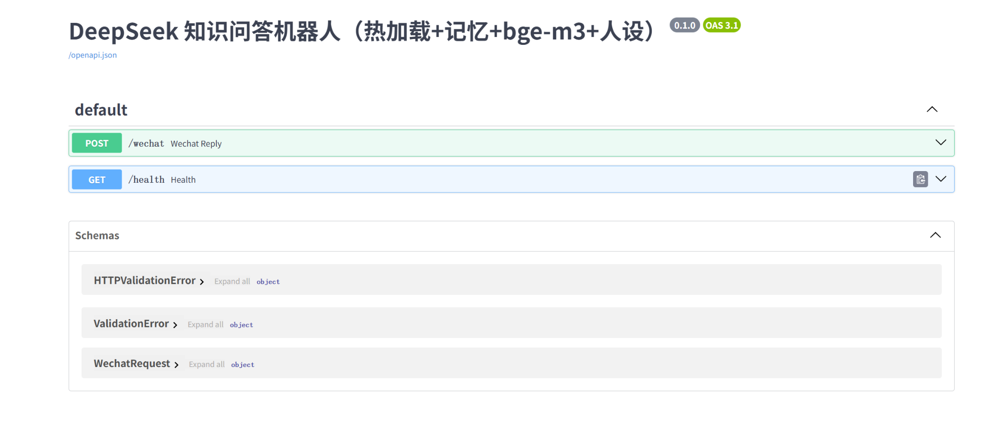
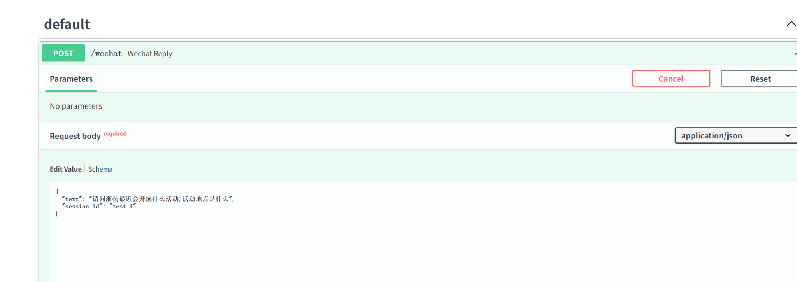
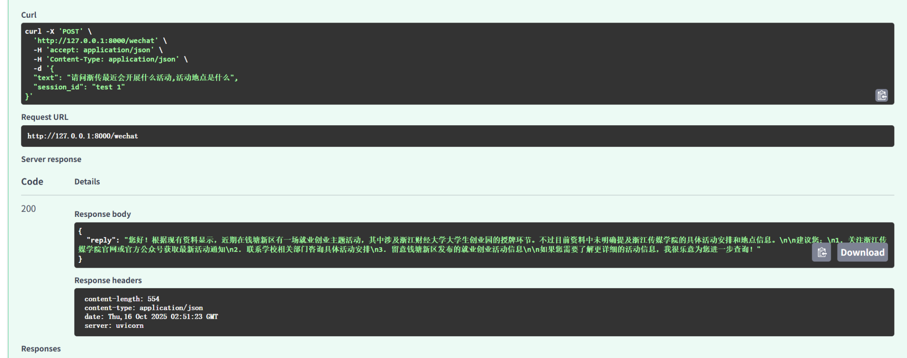
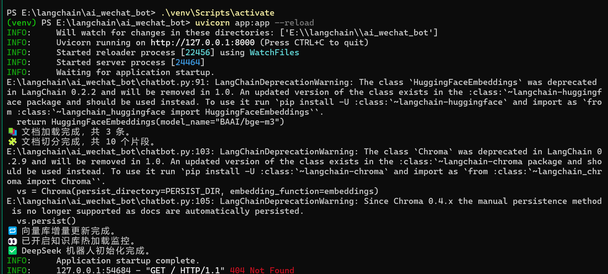
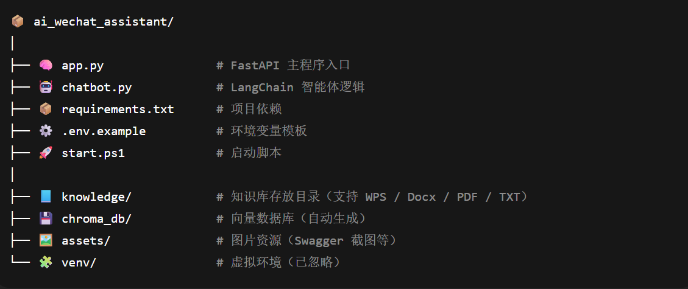

# 🤖 企业微信智能体客服系统（AI WeChat Assistant Bot）

一个基于 **LangChain + FastAPI + DeepSeek + bge-m3 向量检索** 的智能客服系统。  
支持知识库热加载、上下文记忆、多文件格式识别（txt、docx、pdf、WPS文档等），可接入 **企业微信 / 飞书 / n8n Webhook** 实现自动回复与知识问答。

---

## ✨ 功能亮点

✅ **知识库热更新**：文件夹内文档变动实时重建向量库  
✅ **上下文记忆**：支持多 session 独立记忆  
✅ **多格式支持**：自动解析 txt / pdf / docx / WPS 文件  
✅ **中文语义检索**：内置 bge-m3 嵌入模型  
✅ **本地可运行**：无需云服务器，完全离线即可使用  
✅ **可扩展接口**：兼容 Feishu、WeCom、n8n 等 webhook 自动化工具  

---

## 🧩 系统架构

📩 企业微信 / 飞书 / n8n Webhook  
  ⬇️ HTTP POST  
⚙️ FastAPI 接口（/wechat）  
  ⬇️  
🧠 LangChain 逻辑层（chatbot.py）  
 ├── DeepSeek API 调用  
 ├── 知识库管理（knowledge/）  
 │  ⬇️ Chroma 向量数据库（chroma_db/）  
 │   ⬇️ 嵌入模型 bge-m3  
 └── Session 记忆管理  
 ⬇️  
📤 返回 JSON 回复

⚙️ 本地运行步骤

1️⃣ 环境准备

git clone https://github.com/jace221112-peter/ai_wechat_assistant.git

cd ai_wechat_assistant

python -m venv venv

.\venv\Scripts\activate

pip install -r requirements.txt

2️⃣ 配置环境变量

创建 .env 文件，内容如下：

DEEPSEEK_API_KEY=你的API密钥

ASSISTANT_ROLE=你的人设（例如：你是一名亲切的售后客服）

3️⃣ 启动服务

uvicorn app:app --reload

运行成功后访问：

http://127.0.0.1:8000/docs

🌈 示例展示模块	
界面截图

Swagger UI文档：

控制台运行：

响应示例：

PowerShell 启动	：

📂 项目结构

项目结构示例：

💬 项目说明
本项目核心由 LangChain 提供语义检索能力

DeepSeek API 负责自然语言理解与生成

通过 FastAPI 提供统一的 HTTP 接口

可嵌入企业微信客服、飞书机器人、n8n 工作流，实现自动化智能回复。

📚 依赖说明

依赖库---------------说明

FastAPI--------------轻量级 Web 框架

LangChain----------智能体框架

ChromaDB----------本地向量数据库

bge-m3-------------中文嵌入模型

Watchdog	----------文件监控（热加载）

dotenv--------------环境变量管理

Pydantic------------数据模型定义

🚀 后续扩展计划
 接入 Feishu、WeCom 自动化客服

 增加多知识库管理后台

 支持文档批量导入与版本管理

 打包 Docker 容器部署

👨‍💻 开发者信息
作者：@jace221112-peter
项目地址：https://github.com/jace221112-peter/ai_wechat_assistant

如果你喜欢这个项目，请为它点一颗 ⭐ Star！